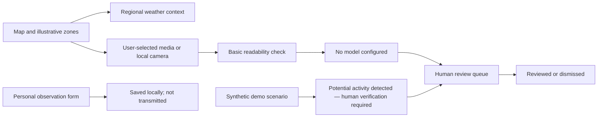

# GreenGuard AI

**Eyes in the Sky. Eyes on the Ground.**  
An independent environmental-monitoring prototype and seminar experience.

[](https://shivnandan225.github.io/github-copilot-seminar/)
[](https://www.python.org/)
[](https://fastapi.tiangolo.com/)
[](https://leafletjs.com/)

GreenGuard presents a three-part journey: arrive in an Aravalli landscape, learn about its ecological context, then explore a map-led monitoring and human-review prototype.

**[Open the live demo](https://shivnandan225.github.io/github-copilot-seminar/)** · [View the repository](https://github.com/shivnandan225/github-copilot-seminar)

> The selectable starting pin is an approximate location near Udaipur, Rajasthan. Its map boundary and device locations are illustrative—not an official forest boundary. The Aravalli range is in north-western India, not Madhya Pradesh.

## The experience

1. **Arrive:** a nature-inspired welcome and credited Aravalli photographs.
2. **Understand:** short stories about wildlife, water, communities, and landscape change.
3. **Stand watch:** an interactive map, regional weather-model context, local camera preview, synthetic alert walkthrough, human review queue, and observation-report form.

The prototype demonstrates a possible monitoring workflow, not a deployed forest surveillance system. It does not identify people or determine that a crime occurred.

## What works today

| Feature | Current behavior |
| --- | --- |
| Interactive geospatial map | Leaflet street and imagery basemaps; illustrative zones, device placeholders, and demo event markers |
| Zone and point registration | Create map zones, load a GeoJSON boundary, and register camera/acoustic/location placeholders |
| Regional weather | Current Open-Meteo model conditions near the selected demo zone; not a forest sensor reading |
| Camera preview | Optional permissioned camera from the visitor's own device, or image/video preview; media is not saved |
| Media inspection | Basic file readability checks only; no object-detection model is configured |
| Demonstration alerts | One-click sample and timed synthetic scenarios for camera, acoustic, and satellite-review workflows |
| Human review | Mark a sample event reviewed, dismiss it, or reopen it |
| Observation reports | Save locally and export reports; reports are not sent to authorities |
| GitHub Pages demo | Browser-local demonstration API backed by that browser's local storage |
| Local API | FastAPI and SQLite routes for zones, points, reviews, reports, weather, and media inspection |

Satellite imagery is an optional map basemap with provider-dependent capture dates—not live satellite video or change detection. A Forest Fusion Engine, risk heatmap, real-time field cameras, acoustic analysis, fire/smoke model, and verified satellite observations are **future concepts**, not currently connected features.

## Why a human stays in the loop

Automated monitoring can be noisy, incomplete, or wrong. Alerts are prompts for careful review—not evidence, accusations, or proof of illegal activity. Any AI-generated event must use the wording:

> **Potential activity detected — human verification required.**

The user-submitted report form collects personal observations but does not transmit them. If an email address is independently verified and provided, the site can open a draft for the user to inspect; it never sends the message. GreenGuard is not a government service, has no official partnership, and has no officer-notification channel.

## Demo and data transparency

The application starts in **DEMO DATA MODE**. There are no configured live forest cameras, acoustic sensors, satellite-change observations, computer-vision model, official forest boundary, or authority reporting channel.

- Zone outlines, sensor markers, sample alerts, and review events are illustrative or synthetic—not verified incidents or observations.
- The 60-second walkthrough creates synthetic events; it makes no real-world detections.
- The alert tone is browser-generated, opt-in, and demonstration-only.
- Local webcam use requires the visitor's permission. It is not an Aravalli field camera.
- Uploaded media is inspected for basic readability only and is not saved or analyzed by an object detector.
- Weather is a regional model estimate. Map imagery is geographic context, not proof of current conditions.
- Wildlife examples are associated with parts of the broader Aravalli region; they do not confirm sightings at the demo pin.
- Automated change detection can produce false positives and requires verification.

## System workflow



## Architecture

| Layer | Implementation |
| --- | --- |
| Frontend | HTML5, CSS3, JavaScript, responsive layout |
| Mapping | Leaflet with OpenStreetMap and Esri imagery basemaps |
| Local backend | Python, FastAPI, SQLite |
| Media interface | Replaceable detector interface; current provider is unconfigured |
| Static deployment | GitHub Pages with a browser-local API adapter |

GitHub Pages serves static files only; it cannot run FastAPI or SQLite. On Pages, zones, points, review states, and reports live in the visitor's browser local storage. The local FastAPI version stores application data in SQLite. The two modes do not share a database.

## Run locally

Requires Python 3.10+.

```powershell
python -m venv .venv
.\.venv\Scripts\Activate.ps1
python -m pip install -r requirements.txt
python -m uvicorn app.main:app --reload
```

Open [http://127.0.0.1:8000](http://127.0.0.1:8000). Internet access is needed for map tiles, Leaflet, landscape photographs, geocoding, and regional weather. Webcam access requires HTTPS or localhost and the visitor's permission.

Set `GREEN_GUARD_DB` to a file path to use a different SQLite database from `data/greenguard.db`. Interactive API documentation is available at [http://127.0.0.1:8000/docs](http://127.0.0.1:8000/docs).

### API

- `GET /api/overview`, `/api/zones`, `/api/points`, `/api/events`, `/api/reports`, `/api/system`
- `GET /api/weather?latitude=24.58&longitude=73.68` — regional Open-Meteo weather-model conditions
- `POST /api/zones` — create a zone with a GeoJSON Polygon or MultiPolygon
- `POST /api/points` — register a monitoring point or device placeholder
- `POST /api/demo/events` — create a synthetic event for the walkthrough
- `PATCH /api/events/{event_id}` — update human-review status
- `POST /api/reports` — save an unverified observation report; never transmits it
- `POST /api/media/analyze` — inspect an image/video through the configured detector interface

### Project structure

```text
.
├── .github/workflows/deploy-pages.yml
├── app/
│   ├── database.py
│   ├── detector.py
│   ├── main.py
│   └── static/
│       ├── app.js
│       ├── index.html
│       ├── static-demo.js
│       └── styles.css
├── requirements.txt
└── README.md
```

## Future roadmap

These are potential next steps; they are not live features:

- [ ] Connect a verified satellite change-detection provider
- [ ] Integrate authorized field-camera streams and a vetted vision model
- [ ] Evaluate fire/smoke and acoustic event-classification models
- [ ] Add consent-based sensor/IoT integration and edge processing
- [ ] Build explainable, uncertainty-aware geospatial analytics
- [ ] Add verified environmental datasets and local review processes
- [ ] Provide role-based authority workflows and secure notifications
- [ ] Migrate to a production database and define retention/privacy controls
- [ ] Evaluate mobile and offline operation for authorized field teams

## Credits and sources

The landscape story uses still photographs from Wikimedia Commons; photographer, location, and license are linked beside each image. Map layers are credited in the map. Regional weather is provided by [Open-Meteo](https://open-meteo.com/). Wildlife and landscape descriptions are general context, not site-specific ecological claims.

## Built with GitHub Copilot

GitHub Copilot was used as an AI-assisted development partner for exploring architecture, iterating on frontend and API implementation, debugging, documentation, and deployment workflow work. The project and its technical decisions were directed and reviewed by its author.

## The vision

GreenGuard AI aims to demonstrate how geospatial interfaces, environmental context, carefully scoped analysis, and human verification might work together in future monitoring systems—once verified data providers, authorized sensors, privacy safeguards, and operational partners are in place.

**Eyes in the Sky. Eyes on the Ground.**

- **Live demo:** [shivnandan225.github.io/github-copilot-seminar](https://shivnandan225.github.io/github-copilot-seminar/)
- **Repository:** [github.com/shivnandan225/github-copilot-seminar](https://github.com/shivnandan225/github-copilot-seminar)
- **Author:** Shivnandan
- **Category:** Environmental monitoring · AI prototype · geospatial technology
